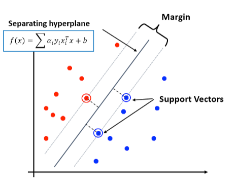
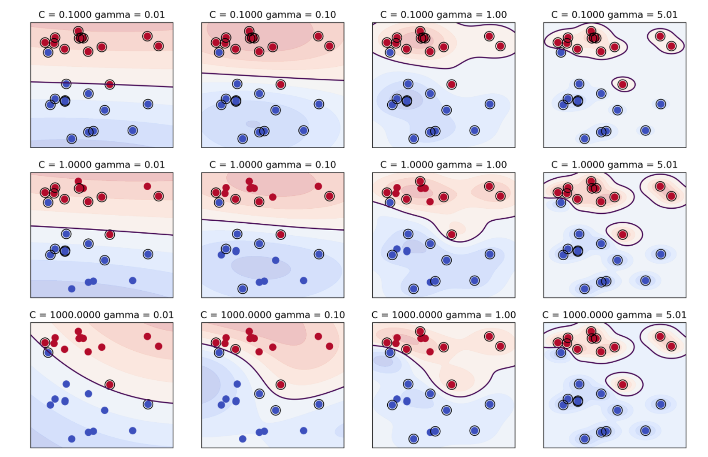

# INTRO
## Ⅰ. AI (Artificial Intelligence)


<br/>

### 1. Rule-base AI
- 특정 상황을 이해하는 전문가가 직접 입력값(문제)과 특징을 전달(규칙)하여 출력값(정답)을 내보내는 알고리즘이다.
- 광범위한 데이터 수집, 정리 또는 교육이 필요하지 않으므로 전문가의 기존 지식을 기반으로 비지니스 규칙을 정의하여 구현 복잡성을 줄일 수 있다.
- 의사 결정 프로세스가 명시적인 "if-then" 사전 정의 규칙에 의존하므로 높은 투명성을 제공한다.
- 본질적으로 정적이며 유연성이 없기 때문에, 사전 정의된 규칙을 수동으로 조정하여 변화나 진화하는 조건에만 적응할 수 있다.
- 사전 정의된 규칙이 명확한 지침을 제공하지 않는 모호하거나 불확실한 상황에 직면할 때 어려움을 겪을 수 있다.
- 미리 정의된 기준에 의존하면, 전문가 개인의 편견이 들어갈 수 밖에 없고, 이로 인해 미묘한 행동을 설명하지 못할 수 있으며, 잠재적으로 불공평하거나 부정확한 평가로 이어질 수 있다.

<br/>
<br/>

### 2. Machine Learning AI
- 데이터를 기반으로 규칙성(패턴)을 학습하여 결과를 추론하는 알고리즘이다.
- 현실 세계의 패턴을 분석하여 개발자가 직접 코드를 작성하는 것이 어려웠으나 머신러닝을 이용해서 해결할 수 있다.

- <sub>※</sub> 데이터 마이닝, 음성 인식(언어 구분), 영상 인식(이미지 판별), 자연어 처리(번역, 문맥 찾기)에서 머신러닝이 적용된다.  
<sub>※ 데이터 마이닝이란, 대규모 데이터 안에서 체계적이고 자동적으로 통계적 규칙이나 짜임을 분석하여 가치있는 정보를 빼내는 과정이다.</sub>
- 데이터의 패턴을 학습하여 이를 통해 예측 등을 수행할 수 있다.

<br/>

#### 2-1. 지도 학습 (Supervised Learning)
입력값(문제)과 출력값(정답)을 전달하면, 알아서 특징을 직접 추출하는 방식이다.  
다른 입력값(문제)과 동일한 출력값(정답)을 전달하면 새로운 특징을 알아서 추출한다.

문제(Feature, 독립변수)와 답(Target, 종속변수, Label)을 주는 것이다.
- 분류 (이진 분류? = 코로나 양성/음성, 사기 번호/일반 번호 등 단일 값 예측) > 범주형 = 분류  
  다중분류 = 약 21개 중에 하나 먹어야함
- 회귀 (1년 뒤의 매출액, 내일 주식 가격 등 연속 값 예측) > 수치형 = 회귀

<sub>※ 사수 같은 느낌.. 문제랑 정답 AI한테 알려줌</sub>

<br/>

#### 2-2. 비지도 학습 (Unsupervised Learning)
입력값(문제)만 전달하고 정답 없이 특징만 추출하는 학습이다.
추출한 특징에 대해 AI가 출력값(정답)을 부여하여 입력값(문제)은 출력값(정답)이라는 것을 알아낸다.

문제(Feature)를 주고 답은 주지 않는 것이다.
- 군집화(클러스터링, 비슷한 문제를 분석하여 편을 나누어 각 편으로 모으는 것)
- 차원 축소 (문제이 개수를 압축(축소)하여 함축된 의미를 찾아내는 것)

<sub>※ 사수가 없는 느낌... 문제만 던져주기</sub>

<br/>

#### 2-3. 강화 학습 (Reinforcement Learning)  
https://kr.mathworks.com/discovery/reinforcement-learning.html

<br/>

#### ○ Machine Learning의 단점
- 데이터에 의존적이다 (Garbage In, Garbage Out), 데이터가 안 좋으면 결과도 안 좋을 수 밖에 없다.  
  ※ 데이터에 의존적이던 머신러닝을 해소하기 위해 나온 건 딥러닝
- 학습 데이터로 잘 만들어진 로직을 가진 모델일지라도 실제 데이터 적용 시 정확한 결과가 나오지 않을 수 있다.
- 머신러닝 학습을 통해 로직이 생기면, 나온 결과가 어떻게 이렇게 나왔는 지에 대한 분석이 쉽지 않다(블랙박스).
- 데이터를 넣으면 원하는 것처럼 좋은 결과를 얻기란 쉽지 않다.

<br/>
<br/>

### 3. R vs Python
#### 3-1. R
개발 언어에 익숙하지 않지만, 통계 분석에 능한 현업 사용자일 경우  
오랜 기간동안 쌓인 다양하고 많은 통계 패키지

<br/>

#### 3-2. Python
직관적인 문법, 객체지향 함수형 프로그래밍 언어, 다양한 라이브러리  
다양한 영역 (운영체제, 서버, 네트워크, 등)으로 연계 및 상용화하기 좋음

<br/>
<br/>

### " 머신러닝과 딥러닝은 R보다는 "파이썬"을 사용하자! "

<br/>
<br/>
<br/>
<br/>
<br/>

# classifier
## Ⅰ. classifier
### 1. 분류 (Classifier)
- 대표적인 지도학습 방법 중 하나이며, 다양한 문제와 정답을 학습한 뒤 별도의 테스트에서 정답을 예측한다.
- 주어진 문제와 정답을 먼저 학습한 뒤 새로운 문제에 대한 정답을 예측하는 방식이다.
- 이진 분류 (Binary Classification)의 경우 정답은 0(음성, Negative)과 1(양성, Positive)과 같이 True, False값을 가진다.
- 다중 분류 (Muticlass Classification)는 정답이 가질 수 있는 값은 3개 이상이다(예: 0, 1, 2, 3).

<br/>

#### 1-1. 피처 (Feature) : 독립변수
- 데이터 세트의 일반 컬럼이며, 2차원 이상의 다차원 데이터까지 통들어 피처라고 한다.
- 타겟을 제외한 나머지 속성을 의미한다.
  ※ 컬럼은 전체를 의미, 타겟을 제외한 하나는 피처라고 부름

<br/>

#### 1-2. 레이블 (Label), 클래스(Class), 타겟(Target), 결정(Decision) : 종속변수
- 지도 학습 시, 데이터의 학습을 위해 주어지는 정답을 의미한다.
- 지도 학습 중, 분류의 경우 이를 레이블 또는 클레스라고도 부른다.

<br/>


<br/>
<br/>

### 2. 분류 예측 프로세스


<br/>

#### 2-1. 데이터 세트 분리
**tran_test_split(feature, target, test_size, random_state)**

- 학습 데이터 세트와 테스트 데이터 세트를 분리해 준다.
- feature : 전체 데이터 세트 중 feature
- target : 전체 데이터 세트 중 target
- test_size : 테스트 세트의 비율(0 ~ 1) 
- random_state : 매번 동일한 결과를 원할 때, 원하는 seed(기준점)를 작성한다.

<br/>

#### 2-2. 모델 학습
**fit(train_feature, train_target)**
- 모델을 학습시킬 때 사용한다.
- train_feature: 훈련 데이터 세트 중 feature
- train_target: 훈련 데이터 세트 중 target

<br/>

#### 2-3. 평가
**accuracy_score(y_test, predict(X_test))**
- 모델이 얼마나 잘 예측했는지를 "정확도"라는 평가 지표로 평가할 때 사용한다.
- y_test: 실제 정답
- predict(X_test): 예측한 정답

<br/>
<br/>
<br/>

## Ⅱ. decision tree
### 1. 결정 트리 (Decision Tree)
- 매우 쉽고 유연하게 적용될 수 있는 알고리즘으로서 데이터의 스케일링, 정규화 등의 데이터 전처리의 의존도가 매우 적다.
- 학습을 통해 데이터에 있는 규칙을 자동으로 찾아내서 Tree 기반의 분류 규칙을 만든다.
- 각 특성이 개별적으로 처리되어 데이터를 분할하는데 데이터 스케일의 영향을 받지 않으므로 결정트리에서는 정규화나 표준화 같은 전처리 과정이 필요없다.
- 영향을 가장 많이 미치는 feature를 찾아낼 수도 있다.
- 예측 성능을 계속해서 향상시키면 복잡한 규칙 구조를 가지기 때문에 <sub>※</sub>과적합(Overfitting)이 발생해서 예측 성능이 저하될 수도 있다.
- 가장 상위 노드를 "루트 노드"라고 하며, 나머지 분기점을 "서브  노드", 결정된 분류값 노드를 "리프 노드"라고 한다.

<br/>


<br/>

- 복잡도를 감소시키는 것이 주목적이며, 정보의 복잡도를 불순도(Impurity)라고 한다.
- 이를 수치화한 값으로 지니 계수(Gini coeficient)가 있다.
- 클래스가 섞이지 않고 분류가 잘 되었다면, 분순도가 낮다.
- 클래스가 많이 섞여 있고 분류가 잘 안 되었다면, 분순도가 높다.
- 통계적 분산 정도를 정량화하여 표현한 값이고, 0과 1사이의 값을 가진다. (0의 값을 가질 수록 과적합(Overfitting))
- 지니 계수가 낮을 수록 분류가 잘 된 것이다.

---

<sub>※ 과적합이란, 학습 데이터를 과하게 학습시켜서 실제 데이터에서는 오차가 오히려 증가하는 현상이다.</sub>

<br/>


※ 맨 처음에는 과소적합.. 에러가 많이남

<br/>
<br/>

### 2. Graphviz
- 결정트리 모델을 시각화할 수 있다.
- https://graphviz.org/download/  
  graphviz-9.0.0 (64-bit) EXE installer [sha256]
- https://drive.google.com/file/d/1oCXidIjNAvUT2UcNFEdhRfFhnZ96iHrp/view?usp=sharing

<br/>
<br/>

### 3. Feature 별 중요도
**각 feature가 분류를 나누는 데에 얼마나 큰 영향을 미쳤는지를 표기하는 척도이다.**
- feature_importances_
- 분류를 결정하는 데에 얼만큼 기여했는 지를 feature 별로 수치를 리턴해 준다.

<br/>
<br/>

### 4. 결정 트리의 과적합
- 위에서 알아낸 것처럼 petal length, petal width, 2개의 feature만으로도 분류가 가능하기 때문에, 2차원 산점도를 통해 시각화할 수 있다.
- 마지막까지 노드가 분리되었기 때문에 과적합이 발생했을 가능성이 있고, 이를 <sub>※</sub>하이퍼 파라미터 튜닝을 통해 해결할 수 있다.

<sub>※ 하이퍼 파라미터란 최적의 훈련 모델을 구현하기 위해 알고리즘의 수치를 조정할 수 있는 변수를 의미한다.</sub>

<br/>
<br/>
<br/>

## Ⅲ. 교차 검증 (Cross Validation)
- 기존 방식에서는 데이터 세트에서 학습 데이터 세트와 테스트 데이터 세트를 분리한 뒤 모델 검증을 진행한다.
- 교차 검증 시, 학습 데이터를 다시 분할하여 학습 데이터와 모델 성능을 1차 평가하는 검증 데이터로 나눈다.

<br/>


<br/>

### 1. 교차 검증의 장단점
- 👍 특정 데이터 세트에 대한 과적합 방지
- 👍 데이터 세트 규모가 적을 시 과소적합 방지
- 👎 모델 훈련, 모델 평가에 소요되는 시간 증가
- 즉, 과적합을 피하고 하이퍼 파라미터를 튜닝함으로써 모델을 일반화하고 신뢰성을 증가시키기 위한 목적이다

<br/>
<br/>

### 2. 교차 검증의 종류
#### 2-1. K-Fold
- k개의 데이터 폴드 세트를 만든 뒤 k번 만큼 학습과 검증 평가를 반복하여 수행하는 방식.
- 학습 데이터와 검증 데이터를 정확히 자르기 때문에 타겟 데이터의 비중이 한 곳으로 치중될 수 있다.
- 예를 들어, 0, 1, 2 중에서 0, 1, 두 가지만 잘라서 검증하게 되면 다른 하나의 타겟 데이터를 예측할 수 없게 된다.
- Stratified K-Fold로 해결한다.

<br/>

#### 2-2. Stratified K-Fold
- k-Fold와 마찬가지로 k번 수행하지만, 학습 데이터 세트와 검증 데이터 세트가 가지는 타겟 분포도가 유사하도록 검증한다.
- 타겟 데이터의 비중을 항상 똑같게 자르기 때문에 데이터가 한 곳으로 치중되는 것을 방지한다.
<br/>


※ 평균 검증 결과가 나오게 된다.

<br/>

#### 2-3. GridSearchCV
- 교차 검증과 최적의 하이퍼 파라미터 튜닝을 한번에 할 수 있는 객체이다.
- max_depth와 min_samples_split에 1차원 정수형 list를 전달하면,  
  2차원으로 결합하여 격자(Grid)를 만들고 이 중 최적의 점을 찾아낸다.
- 딥러닝에서는 학습 속도가 머신러닝에 비해 느리고,  
  레이어(층)가 깊어질 수록 조정해 주어야 할 하이퍼 파라미터 값이 많아지기 때문에,  
  RandomSearchCV에서 대략적인 범위를 찾은 다음, GridSearchCV로 디테일을 조정하는 방식을 사용한다.

<br/>


<br/>
<br/>

### 3. 편하게 수행할 수 있는 교차 검증
**cross_val_score(estimator, x, y, cv, scoring)**  
- estimator: classifier 종류 모델이면 내부적으로 startified K-Fold로 진행된다.
- x: features
- y: targets
- cv: 폴드 세트 개수
- scoring: 평가 함수, 정확도(accuracy) 외에 다른 것은 다른 장에서 배운다.

<br/>
<br/>

### 4. GridSearchCV
**GridSearchCV(estimator, param_grid, cv, refit, return_train_score)**
- estimator: 학습할 모델 객체 작성
- param_grid: dict 형태로 전달해야 하며, 주요 key 값은 max_depth, min_samples_split이다.
- cv: 폴드 세트 개수
- refit: 최적의 하이퍼 파라미터로 전달한 모델 객체를 다시 훈련하고자 할 때 True를 전달한다.
- retrun_train_score: 교차 검증 점수를 가져올 지에 대해 True 또는 False를 전달한다.

<br/>
<br/>
<br/>

## Ⅳ. 분류 (Classification) 성능 평가 지표
### 1. 정확도 (Accuracy)
- 직관적으로 모델 예측 성능을 나타낼 수 있다.
- 2진 분류일 경우 데이터 구성에 따라 타겟 데이터 분포가 불균형하다면, 정확도 한 가지만으로는 적합한 성능 평가 지표가 될 수 없다.
- 강아지와 고양이 모두 무조건 생존으로 예측하는 모델이 있다고 가정한다.  
  생존한 강아지 80마리와 사망한 고양이 20마리를 테스트하면, 정확도는 80%이다.
  이 모델을 사용하면, 사망한 강아지 혹은 고양이를 절대 예측할 수 없다.

<br/>


<br/>
<br/>

### 2. 오차 행렬 (Confusion Matrix)
- 학습된 분류 모델이 예측을 수행하면서 얼마나 예측에 오류가 있는지도 함께 보여주는 지표이다.
- 데이터가 한 곳으로 치우친 것도 확인할 수 있으며, TP, TN, FP, FN, 4가지로 구성되어 있다.
- 오차 행렬로 분류 성능 평가 지표의 모든 것을 구할 수 있다(정확도, 정밀도, 재현율, F1 Score, ROC AUC)

<br/>

  

<br/>

1. TN: 예측한 값은 음성이고, 실제 값도 음성일 때 (맞춤)
2. FP: 예측한 값은 양성이고, 실제 값은 음성일 때 (틀림)
3. FN: 예측한 값은 음성이고, 실제 값은 양성일 때 (틀림)
4. TP: 예측한 값은 양성이고, 실제 값도 양성일 때 (맞춤)

<br/>

- 위 강아지와 고양이의 생존률 예측 모델의 오차 행렬은 다음과 같이 나온다.  
  
<br/>

  

<br/>

- 100마리 전부 생존(음성, Negative)으로 예측했으며, 그 중 80마리는 실제 음성이고, 나머지 20마리는 실제 양성이기 때문이다.
- 보통 2진 분류일 경우 음성과 양성을 구분하는 의료학, 연구분야 등에서 많이 사용되며, 두 가지 상황으로 나눌 수 있다.

<br/>

1. 질병이나 이상이 없는데도 양성으로 오진하는 것을 방지하기 위해
  - 특이도(Specificity): 정상을 정상으로 진단하는 비율(▲TN)
  - 재현율(Recall)이 낮아지고 정밀도(Precision)가 높아질 수 있다.
2. 암 진단에서 양성인 환자를 놓치지 않고 최대한 많이 식별하기 위해
  - 민감도(Sensitivity): 질병이 있는 사람을 질병이 있다고 진단하는 비율(▲TP)
  - 재현율(Recall)이 높아지고 정밀도(Precision)가 낮아질 수 있다.

- 1.의 경우 Positive보다는 Negative 예측 정확도를 높일 것이다.  
  ▲TN, ▼TP, 또한, Positive로 예측하는 경우가 매우 작기 때문에, ▼FP
- 2.의 경우 Negative보다는 Positive 예측 정확도를 높일 것이다.  
  ▲TP, ▼TN, 또한, Negative로 예측하는 경우가 매우 작기 때문에, ▼FN
- 📌결과적으로 정확한 판단이 아님에도 불구하고 정확도가 매우 높게 나타나는, 수치적인 판단 오류를 해결해기 위해서는 특이도와 민감도를 잘 조절해야한다.  

<br/>
<br/>

### 3. 정밀도 (Precision)
- 예측을 Positive로 한 대상 중, 예측과 실제 값이 Positive로 일치한 데이터의 비율을 뜻한다.
- ▲TP, ▼FP일 경우 정밀도가 상승한다.
- precision_score()를 사용하여 정밀도를 구할 수 있다.

<br/>
<br/>

### 4. 재현율 (Recall)
- 실제 값이 Positive인 대상 중, 얼마나 놓치지 않고 Positive로 예측했는 가의 비율을 뜻한다.
- ▲TP, ▼FN일 경우 재현율이 상승한다.
- recall_score()를 사용하여 재현율을 구할 수 있다.

<br/>
<br/>

### 5. 정밀도와 재현율의 트레이드 오프 (Trade-off)
분류 시, 결정 임계값(Threshold)을 조정해서 정밀도 또는 재현율의 수치를 높일 수 있다.

<br/>

 가정: 구급대원 AI가 교통사고 현장에서 피해자를 병원으로 이송해야할지 판단해야 하는 시나리오.
- Dead (Positive): 피해자가 이미 사망했을 경우
- Alive (Negative): 피해자가 아직 살아있을 경우  

<br/>

- TP: 모델이 Dead를 Dead로 올바르게 분류한 경우
- FP: 모델이 Alive를 Dead로 잘못 분류한 경우 (error I)
- TN: 모델이 Alive를 Alive로 올바르게 분류한 경우
- FN: 모델이 Dead를 Alive로 잘못 분류한 경우 (error II)

<br/>

- error I의 비용(FP)은 error II의 비용(FN)보다 훨씬 더 나쁘다! ▼ FP, ▼ error I

<br/>


<br/>

- 정밀도 (Precision): 모델이 Dead로 예측한 환자 중에서 실제로 Dead인 환자의 비율을 나타낸다. 즉, 양성으로 예측한 결과 중 얼마나 많은 것이 진짜 양성인지 측정한다.  
- 재현율 (Recall): 실제 Dead 피해자 중에서 모델이 Dead로 정확하게 예측한 피해자의 비율을 나타낸다. 즉, 모델이 얼마나 많은 Dead 피해자를 "놓치지 않고(재현율)" 감지했는지 측정한다.  

<br/>

- 이는 정밀도를 높여야 하며, Threshold(임계값)을 높여서 FP를 낮추고(▲정밀도), FN을 높여야 한다(▼재현율).
- 즉, Negative(Alive)로 예측할 확률이 높아져야 생명을 구할 확률이 높아지고, Threshold value(임계값)를 높여주는 것이다.
- 위의 시나리오처럼 한 쪽의 수치를 강제로 높이면 다른 한 쪽의 수치는 떨어지며,  
  이를 정밀도와 재현율의 "트레이드 오프"라고 한다.
- 임계치가 높아지면 정밀도가 높아진다. 반대로 임계치가 낮아지면 재현율이 높아진다.

<br/>
<br/>

### 6. F1 Score
- 2진 분류 모델의 성능을 평가하는 지표 중 하나이다.
- 정밀도(Precision)와 재현율(Recall)의 조화 평균(모든 데이터에 동일한 가중치)으로 계산되는 성능 측정 지표이다.
- 정확도(Accuracy)와 같이 전체 성능에 대한 지표가 아닌 타겟 데이터별 성능을 자세히 분석하는 평가지표이다.
- 정밀도(Precision)와 재현율(Recall), 두 개의평가 지표를 모두 고려하여 예측 성능을 평가하기 때문에 두 지표의 평균치를 구하는 조화 평균을 사용하여 조금 더 정확하게 모델의 예측 성능을 평가할 수 있다.
- 텍스트 분류, 정보 검색, 암 진단 등에서 사용되는 모델의 성능을 평가할 수 있다.

<br/>


<br/>

- F1 Score는 0~1까지 점수를 매길 수 있으며, 0에 가까울 수록 정밀도와 재현율 모두 낮다는 뜻이다.

<br/>
<br/>

### 7. ROC Curve, AUC
- ROC(Receiver Operating Characteristic)는 수신기 동작 특성이라는 뜻이고, 이러한 이름이 붙은 이유는 2차 세계대전 때 무선 기기 성능 평가 때 사용되었기 때문이다.
- FPR이 변할 때, TPR이 어떻게 변하는지를 나타내는 곡선이며, FPR이 급격히 떨어지더라도 TPR은 천천히 떨어지는 것이 좋은 성능을 가진 모델로 판단한다.

<br/>


<br/>

- AUC(Area Under the Curve)는 ROC 곡선 밑의 면적을 구한 것으로써, 일반적으로 1에 가까울수록 좋은 수치이다.
- ROC Curve가 축에 붙을 수록(좌상단 모서리) 좋은 성능을 나타내는 것이며, 높이와 및변이 1인 사각형으로 가정했을 경우 ROC Curve가 축에 붙을 수록 AUC 면적이 넓어지며 1에 가까워진다.
- 모델이 양성과 음성을 얼마나 잘 분류하는지 시각화할 수 있다.
- 보통 F1 Score가 0.7 이상일 경우 좋은 모델이라고 간주한다.

<br/>


<br/>
<br/>
<br/>

## Ⅴ. naive bayes
### 1. 베이즈 추론, 베이즈 정리, 베이즈 추정 (Bayesian Inference)
- 역확률(inverse probability) 문제를 해결하기 위한 방법으로서, 조건부 확률(P(B|A)))을 알고 있을 때, 정반대인 조건부 확률(P(A|B))을 구하는 방법이다.  

- 추론 대상의 사전 확률과 추가적인 정보를 기반으로 해당 대상의 "사후 확률"을 추론하는 통계적 방법이다.

- 어떤 사건이 서로 "배반"하는(독립하는) 원인 둘에 의해 일어난다고 하면, 실제 사건이 일어났을 때 이 사건이 두 원인 중 하나일 확률을 구하는 방식이다.

- 어떤 상황에서 N개의 원인이 있을 때, 실제 사건이 발생하면 N개 중 한 가지 원인일 확률을 구하는 방법이다.

- 기존 사건들의 확률을 알 수 없을 때, 전혀 사용할 수 없는 방식이다.

- 하지만, 그 간 데이터가 쌓이면서, 기존 사건들의 확률을 대략적으로 뽑아낼 수 있게 되었다.

- 이로 인해, 사회적 통계나 주식에서 베이즈 정리 활용이 필수로 꼽히고 있다.  

<br/>

(예시)
  ```
  질병 A의 양성판정 정확도가 80%인 검사기가 있다.  
  검사를 시행해서 양성이 나왔다면, 이 사람이 80%의 확률로 병에 걸렸다고 이야기할 수 없다.  
  왜냐하면 검사기가 알려주는 확률과 양성일 경우 질병을 앓고 있을 확률은 조건부 확률의 의미에서 정반대이기 때문이다.  
  ```

<br/>

<table style="width:50%; margin-left: 50px">
    <tr>
        <th>전제</th>
        <th>관심 사건</th>
        <th>확률</th>
    </tr>
    <tr>
        <th>병을 앓고 있다</th>
        <th>양성이다</th>
        <th>80%</th>
    </tr>
    <tr>
        <th>양성이다</th>
        <th>병을 앓고 있다</th>
        <th>알수 없음</th>
    </tr>
</table>  

<br/>

이런 식의 확률을 구해야 하는 문제를 역확률 문제라고 하고 이를 베이즈 추론을 활용하여 구할 수 있다.  
단, 검사 대상인 질병의 유병률(사전 확률, 기존 사건들의 확률)을 알고 있어야 한다.  
전세계 인구 중 10%의 사람들이 질병 A를 앓는다고 가정한다.

<br/>


<div style="width: 60%; display:flex; margin-top: -20px; margin-left:30px">
    <div>
        
    </div>
    <div style="margin-top: 28px; margin-left: 20px">
        
    </div>
</div>  

<div style="width: 60%; display:flex; margin-left:30px">
    <div>
        
    </div>
    <div style="margin-top: 28px; margin-left: 20px">
        
    </div>
</div>  

<br/>

🚩결과: 약 30.8% 

<br/>
<br/>

## 2. 나이브 베이즈 분류 (Naive Bayes Classifier)
- 텍스트 분류를 위해 전통적으로 사용되는 분류기로서, 분류에 있어서 준수한 성능을 보인다.

- 베이즈 정리에 기반한 통계적 분류 기법으로서, 정확성도 높고 대용량 데이터에 대한 속도도 빠르다.

- 반드시 모든 feature가 서로 독립적이여야 한다. 즉, 서로 영향을 미치지 않는 feature들로 구성되어야 한다.

- 감정 분석, 스팸 메일 필터링, 텍스트 분류, 추천 시스템 등 여러 서비스에서 활용되는 분류 기법이다.

- 빠르고 정확하고 간단한 분류 방법이지만, 실제 데이터에서  
  모든 feature가 독립적인 경우는 드물기 때문에 실생활에 적용하기 어려운 점이 있다.

<br/>


<br/>
<br/>
<br/>

## Ⅵ. support vector machine
### 1. 서포트 벡터 머신 (SVM, Support Vector Machine)
기존의 분류 방법들은 '오류율 최소화'의 목적으로 설계되었다면, SVM은 두 부류 사이에 존재하는 '여백 최대화'의 목적으로 설계되었다.

분류 문제를 해결하는 지도 학습 모델 중 하나이며, 결정 경계라는 데이터 간 경계를 정의함으로써 분류를 할 수 있다.

새로운 데이터가 경계를 기준으로 어떤 방향에 잡히는지를 확인함으로써 해당 데이터의 카테고리를 예측할 수 있다.

데이터가 어느 카테고리에 속할지 판단하기 위해 가장 적절한 경계인 결정 경계를 찾는 선형 모델이다.  

<br/>


<br/>
<br/>

#### 1-1. 서포트 벡터 (Support Vector)
결정 경계를 결정하는 데이터(벡터)들을 서포트 벡터라고 부른다.

서포트 벡터들이 결정 경계 (Decision boundary)를 결정한다.

서포트 벡터와 결정 경계간의 거리를 마진(Margin)이라고 부르고, 마진이 크면 클 수록 좋은 결정 경계가 된다.

서포트 벡터들을 통해 결정 경계를 결정하게 되고, 다른 학습 데이터들은 무시될 수 있기 때문에 SVM의 속도가 빠를 수 있다.

<br>

#### 1-2. 결정 경계 (Decision boundary)
새로운 데이터가 들어오더라도 결정 경계를 중심으로 두 집단이 멀리 떨어져 있어야 두 집단을 잘 구분할 수 있기 때문에 일반화하기 쉬워진다.

예측 변수의 차원보다 한 차원 낮아지며, N차원 공간에서 한 차원 낮은 N-1차원의 결정 경계가 생긴다.  
즉, 2차원 공간에서 결정 경계는 선으로 결정되고, 고차원에서는 결정 경계는 선이 아닌 평면 이상의 도형이며,  
이를 "초평면(Hyperplane)"이라고 부른다.

<br/>



<br/>

#### 1-3. 하드 마진(Hard margin)
매우 엄격하게 집단을 구분하는 방법으로 이상치를 허용해 주지 않는 방법이다.  
이상치를 허용하지 않기 때문에 과적합이 발생하기 쉽고, 최적의 결정 경계를 잘 못 구분하거나 못 찾는 경우가 생길 수 있다.

<br/>

- C(cost)는 패널티를 조절할 수 있고, 값이 커질수록 결정 경계가 데이터에 더 정확하게 맞춰진다.
- C를 낮추면 일을 덜하게 하는 것이고, C를 높이면 일을 더해서 더 섬세하게 찾아낸다.
- C가 너무 낮으면 underfitting 될 가능성이 커지고, C가 너무 높으면 overfitting이 발생할 수 있다.

<br/>


<br/>

#### 1-4. 소프트 마진(Soft margin)
이상치를 허용해서 일부 데이터를 잘못 분류하더라도 나머지 데이터를 더욱 잘 분류해 주는 방법이다.
이상치 허용으로 인해 데이터의 패턴을 잘 감지하지 못하는 문제점이 생길 수 있다.


<br/>

#### ○ 정리  
1. 서포트 벡터 머신 알고리즘을 적용한 SVC 모델의 하이퍼파라미터는 Regularization cost, C에 값을 전달하여 ξ(패널티)를 조절할 수 있다.

2. C가 클 수록 loss function에서 오차항인 ξ<sub>i</sub>의 영향력이 커지게 되기 때문에 마진의 크기가 줄어들고(하드 마진),  
반대로 C가 작을 수록 마진의 크기가 늘어난다(소프트 마진). 적절히 조절하면 오히려 성능이 좋아질 수 있다.

<br/>

#### 1-5. 커널 트릭 (Kernel trick)
선형으로 완전히 분류할 수 없는 데이터 분포가 있을 경우 소프트 마진을 통해 어느정도 오류는 허용하는 형태로 분류할 수는 있다.  

하지만, 더 잘 분류하기 위해서는 차원을 높여야 한다.  
이를 고차원 매핑이라고 하고 이 때 커널 트릭을 사용한다.

저차원으로 해결하기 어려운 문제들은 고차원으로 변환시켜 문제를 해결할 때 사용한다.

<br/>


<br/>

- 비선형 데이터일 때 RBF 커널을 사용하고, 선형 데이터일 때 linear 커널을 사용하는 것이 효과적이다.
- RBF 커널을 사용하게 되면, gamma 하이퍼 파라미터를 조정할 수 있으며, 이는 데이터 포인터들의 영향 범위를 결정한다.
- gamma가 클수록 하나의 벡터 영향력 거리가 짧아지고, gamme가 작을 수록 거리가 길어진다.
- 즉, gamma가 클수록 표준편차가 낮아진다. gamma가 너무 작으면 과소적합될 가능성이 크고, 너무 높으면 과대적합의 위험이 있다.

<br/>



<br/>
<br/>
<br/>

## Ⅶ. feature selection
- 결과 예측에 있어서, 불필요한 feature들로 인해 모델 예측 성능을 떨어뜨릴 가능성을 사전 제거할 수 있다.
- 타겟 데이터와 관련이 없는 feature들을 제거하여,  
  타겟 데이터를 가장 잘 예측하는 feature들의 조합(상관관계가 높은)을 찾아내는 것이 목적이다.

<br/>

### 1. 용어 정리
<table style="margin-left: 0">
    <tr>
        <th style="text-align: center">표현</th>
        <th style="text-align: center">정의</th>
    </tr>
    <tr>
        <td style="text-align: center">Feature Engineering</td>
        <td style="text-align: center">도메인(기본) 지식을 사용하여 데이터에서 피처를 변형 및 생성</td>
    </tr>
    <tr>
        <td style="text-align: center">Feature Extraction</td>
        <td style="text-align: center">차원축소 등 새로운 중요 피처를 추출</td>
    </tr>
    <tr>
        <td style="text-align: center">Feature Selection</td>
        <td style="text-align: center">기존 피처에서 원하는 피처만 선택하는 과정</td>
    </tr>
</table>

<br/>
<br/>

### 2. Recursive Feature Elimination (RFE)
- 모델 최초 학습 이후 feature의 중요도를 선정하는 방식이다.

- feature의 중요도가 낮은 속성들을 차례로 제거하면서  
  원하는 feature의 개수가 남을 때까지 반복적으로 학습 및 평가를 수행한다.

- 경우의 수로 제거해가며 학습을 재수행하기 때문에 시간이 오래 걸린다.

- 몇 개의 feature를 추출해야 할 지 직접 정의해야 하는 것이 단점이다.

<br/>


<br/>
<br/>

### 3. Recursive Feature Elimination Cross Validation (RFECV)
- RFE의 단점을 보완하기 위해 만들어졌으며, 최고의 성능에서의 feature 개수를 알려주고, 해당 feature를 선택해 준다.

- 각 feature 마다 Cross Validation을 진행하여 각기 다른 성능을 도출한다.

- 도출된 성능 수치를 평균 내어 가장 높은 성능을 발휘하는 feature들을 선택한다.

<br/>


<br/>
<br/>

### 4. Permutaion Importance
- Permutation(순열)이란, 서로 다른 n개의 원소에서 r개를 중복없이 순서에 상관있게 선택하는 혹은 나열하는 것이다.  
  여기서 원소는 feature이며, 각 feature 별로 중복없이 선택하여 feature의 중요도를 검증하는 방식이다.

- 임의의 feature의 요소 순서를 무작위로 섞은 후 성능 감소에 대한 평균을 구한다.

- 중요도를 판단하려는 feature의 요소를 noise로 만들어서 전과 후를 비교한 뒤 중요도를 판단한다.

- 임의의 feature를 noise로 만들었을 대 성능이 떨어진 정도로feature importance를 판별할 수 있다.


<br/>
<br/>
<br/>

## Ⅷ. K-Nearest Neighbor (K-최근접 이웃 알고리즘, KNN)
- 임의의 데이터가 주어지면 그 주변(이웃)의 데이터를 살펴본 뒤 더 많은 데이터가 포함되어 있는 범주로 분류하는 방식이다.

- 가장 간단한 머신러닝 알고리즘으로서, 직관적이고 나름 성능도 괜찮다.

- K를 어떻게 정하는지에 따라서 결과값이 바뀔 수 있다.  
  K는 임의의 데이터가 주어졌을 때 가까운 이웃들의 개수이고 기본값은 5이다.

- K는 가장 가까운 5개의 이웃 데이터를 기반으로 분류하며, 일반적으로 홀수를 사용한다.  
  짝수일 경우 동점이 되어 하나의 결과를 도출할 수 없기 때문이다.

<br/>


<br/>

- KNN은 fit을 통해 훈련시키면, 학습하지 않고 저장만 해놓는다.  
  따라서 이러한 모델을 Lazy Model이라고 부른다.

- 새로운 데이터가 주어지면 그제서야 이웃 데이터를 보고 분류해나간다.  
  따라서 사전 모델링이 필요없는 real-time 예측이 이루어진다.

<br/>


<br/>

- 데이터와 데이터 사이의 거리를 구해야 더 가까운 클래스로 분류할 수 있으며,  
  이는 유클리드 거리(Euclidean Distance)방식과 맨해튼 거리(Manhattan Distance)방식이 있다.

<br/>
<br/>
<br/>

## Ⅸ. Ensemble Learning (앙상블 학습)
- 어떤 데이터의 값을 예측한다고 할 때, 하나의 모델만 가지고 결과를 도출할 수도 있지만,  
  여러 개의 모델을 조화롭게 학습시켜 그 모델들의 예측 결과들을 이용한다면, 더 정확한 예측값을 구할 수 있다.

- 여러 개의 분류기를 생성하고 그 예측을 결합하여  
  1개의 분류기를 사용할 때보다 더 정확하고 신뢰성 높은 예측을 도출하는 기법이다.

- 강력한 하나의 모델을 사용하는 것보다 약한 모델을 여러 개 조합하여 더 정확한 예측에 도움을 주는 방식이다.

- 앙상블 학습의 주요 방법은 배깅(Bagging)과 부스팅(Boosting)이다.

<br/>

### 1. 보팅(Voting)
"하나의 데이터 세트"에 대해 서로 다른 알고리즘을 가진 분류기를 결합하는 방식이다.

서로 다른 분류기들에 "동일한 데이터 세트"를 병렬로 학습해서 예측값을 도출하고,  
이를 합산하여 최종 예측값을 산출해내는 방식을 말한다.  

<br/>
  
#### 1-1. 하드 보팅 (Hard Voting)
각 분류기가 만든 예측값을 다수결로 투표해서 가장 많은 표를 얻은 예측값을 최종 예측값으로 결정하는 보팅 방식을 말한다.

<br/>


<br/>

#### 1-2. 소프트 보팅 (Soft Voting)
각 분류기가 예측한 타겟별 확률을 평균내어 가장 높은 확률의 타겟을 최종 예측값으로 도출한다.

<br/> 


<br/>
<br/>

### 2. 배깅 (Bagging, Bootstrap Aggregation)
하나의 데이터 세트에서 "여러 번 중복을 허용하면서 학습 데이터 세트를 랜덤하게 뽑은 뒤(Bootstrap)"  
하나의 예측기 여러 개를 병렬로 학습시켜서 결과물을 집계(Aggregation)하는 방법이다.

Voting 방식과 달리 같은 알고리즘의 분류기를 사용하고 훈련 세트를 무작위로 구성하여 각기 다르게(독립적으로, 병렬로) 학습시킨다.

- 학습 데이터가 충분하지 않더라도 충분한 학습효과를 주어 과적합등의 문제를 해결하는 데 도움을 준다.

- 배깅방식을 사용한 대표적인 알고리즘이 바로 랜덤 포레스트 알고리즘이다.  

<br/>


<br/>
<br/>

### 3. 부스팅(Boosting)
이전 분류기의 학습 결과를 토대로 다음 분류기의 학습 데이터의 샘플 가중치를 조정해서 "순차적으로" 학습을 진행하는 방법이다.

이전 분류기를 계속 개선해 나가는 방향으로 학습이 진행되고, 오답에 대한 높은 가중치를 부여하므로 정확도가 높게 나타난다.

높은 가중치를 부여하기 때문에 이상치(Outlier)에 취약할 수 있다.

<br/>


<br/>

#### 3-1. Adaboost(Adaptive boosting)
부스팅에서 가장 기본 기법이며, 결정 트리와 비슷한 알고리즘을 사용하지만,  
뻗어나가지(tree) 않고 하나의 조건식만 사용(stump)하여 결정한다.

여러 개의 stump로 구성되어 있으며, 이를 Forest of stumps라고 한다.

- stump는 조건식 한 개와 두 갈래의 참, 거짓 리프 노드가 있는 형태이다.

- tree와 다르게, stump는 단 하나의 질문으로 데이터를 분류해야하기 때문에 약한 학습기(weak learner)이다. 

<br/>

  

<br/>

결과에 미치는 영향이 큰 stump를 Amount of Say가 높다(가중치가 높다)고 한다.

각 stump의 error는 다음 stump의 결과에 영향을 미치고 줄줄이 마지막 스텀프까지 영향을 미친다.

모든 stump의 Amount of Say를 수치로 구한 뒤 합치면, Total Amount of Say가 나오고 이를 통해 최종 분류가 된다.

- 하나의 stump는 약한 학습기이지만 여러 스텀프를 모으면 강한 학습기가 된다.  

<br/>

  

<br/>

Total Error가 0이면 항상 올바른 분류를 한다는 뜻이고, 1이면 항상 반대로 분류를 한다는 뜻이다.

만약 Total Error가 0.5라면 Amount of Say는 0이고,  
이는 확률이 반반이기 때문에 분류기로서 분류결과를 랜덤으로 판단하는 것과 같다.

<br/>
<br/>

#### 3-2. GBM(Gradient Boost Machine)
Adaboost와 유사하지만, 에러를 최소화하기 위해 가중치를 업데이트할 때 경사 하강법(Gradient Descent)을 이용한다.

GBM은 과적합에도 강하고 뛰어난 성능을 보이지만, 병렬 처리가 되지 않아서 수행 시간이 오래 걸린다는 단점이 있다.

경사 하강법이란, 오류를 최소화하기 위해 Loss function의 최소값까지 점차 하강하면서 찾아나가는 기법이다.

<br/>

(예시)
```
모델 A를 통해 y를 예측하고 남은 잔차(residual, 에러의 비율)를 다시 B라는 모델을 통해 예측하고  
A + B모델을 통해 y를 예측하는 방식이다.
```
- 잔차를 계속 줄여나가며, 훈련 데이터 세트를 잘 예측하는 모델을 만들 수 있게 된다.
- 잔차를 계속 줄이다보면 복잡도가 증가하여 과적합이 일어날 수도 있다는 단점이 있다.  

<br/>

  

<br/>
<br/>

#### 3-3. XGBoost(eXtra Gradient Boost)
트리 기반의 앙상블 학습에서 가장 각광받고 있는 알고리즘 중 하나이며,  
분류에 있어서 일반적으로 다른 머신 러닝보다 뛰어난 예측 성능을 나타낸다.

GBM에 기반하고 있지만 병렬 CPU 환경에서 병렬 학습이 가능하기 때문에 기존 GBM보다 빠르게 학습을 완료할 수 있다.

하이퍼 파라미터를 조정하여 분할 깊이를 변경할 수 있지만,  
tree pruning(가지치기)으로 더 이상 긍정 이득이 없는 분할을 가지치기해서 분할 수를 줄이는 추가적인 장점을 가지고 있다.

<br/>

  

<br/>

조기 중단 기능(Early Stopping)은 특정 반복 횟수만큼 더 이상 loss function이 감소하지 않으면 수행을 종료할 수 있다.  
학습 시간을 단축시킬 수 있으며, 최적화 튜닝 시 적절하게 사용 가능하다.  
하지만, 반복 횟수를 너무 낮게 설정하면, 최적화 전에 학습이 종료될 수 있기 때문에 조심해야 한다.  

<br/>

  

<br/>

#### 3-4. LightGBM(Light Gradient Boosting Machine)
XGBoost의 향상된 버전으로서 결정트리 알고리즘을 기반으로 순위 지정, 분류 및 기타 여러 기계 학습 작업에 사용할 수 있다.

기존 부스팅 방식과 마찬가지로 각각의 새로운 분류기가 이전 트리의 잔차를 조정해서 모델이 향상되는 방식으로 결합되고,  
마지막으로 추가된 트리는 각 단계의 결과를 집계하여 강력한 분류기가 될 수 있다.

XGBoost와 달리 GOSS 알고리즘을 사용해서 수직으로 트리를 성장시킨다.  
즉, 다른 알고리즘은 레벨(depth) 단위로 성장시키지만, LightGBM은 리프(leaf) 단위로 성장시킨다.

인코딩을 따로 할 필요 없이 카테고리형 feature를 최적으로 변환하고 이에 따른 노드 분할을 수행한다.

astype('category')로 변환할 수 있으며, 이는 다른 다양한 인코딩 방식보다 월등히 우수하다.  

- GOSS 논문  
  https://proceedings.neurips.cc/paper_files/paper/2017/file/6449f44a102fde848669bdd9eb6b76fa-Paper.pdf  

<br/>

  

<br/>

<div style="display: flex;">
    <div>
         
    </div>
    <div>
          
    </div>
</div>

<br/>
<br/>
<br/>

## Ⅹ. 데이터 전처리
### 1. StandardScaler()
<code>from sklearn.preprocessing import StandardScaler</code>

데이터의 평균을 0, 분산을 1이 되도록, 표준 정규분포를 따르게 하는 스케일링  
± 1.96을 벗어나면 이상치로 판단한다.

<br>
<br>

### 2. MinMaxScaler()
<code>from sklearn.preprocessing import MinMaxScaler</code>

데이터가 0~1 사이에 위치하도록 최소값은 0, 최대값은 1로 변환한다.  
서로 다른 단위의 feature끼리 비교가 가능해진다.

<br>
<br>

### 3. MaxAbsScaler()
<code>from sklearn.preprocessing import MaxAbsScaler</code>

모든 값을 -1~1 사이에 위치하도록, 절대값의 최소값은 0, 최대값은 1이 되도록 변환한다.  
양의 방향에 대한 단위뿐 아니라 음의 방향에 대한 단위까지 스케일링하고자 할 때 사용한다.

<br>
<br>

### 4. 로그변환 (Log transformation)
<code>np.log1p(df['col'])</code>

왜도와 첨도를 가진 변수를 정규분포에 가깝게 만들어준다. 큰 수치를 같은 비율의 작은 수치로 변환한다.

<br>

<code>np.expm1(df['col'])</code>

원래 값으로 전환하고자 할 때 지수를 취해준다.

<br>
<br>

### 5.  언더 샘플링 (Under sampling)
불균형한 데이터 세트에서 높은 비율을 차지하던 클래스의 데이터 수를 줄임으로써 데이터 불균형을 해소한다.  
학습에서 사용되는 전체 데이터 수를 급격하게 감소시켜 오히려 성능이 떨어질 수 있다.

<br>


<br>
<br>

### 6. 오버 샘플링 (Over sampling)
불균형한 데이터 세트에서 낮은 비율 클래스의 데이터 수를 늘림으로써 데이터 불균형을 해소한다.  
오버 샘플링의 대표적인 방법에는 SMOTE(Synthetic Minority Over-sampling Technique)가 있다.

<br>


<br>
<br>

### 7. SMOTE (Synthetic Minority Over-sampling Technique)
반드시 학습 데이터 세트만 오버 샘플링 해야 한다.

검증 혹은 테스트 데이터 세트를 오버 샘플링하는 경우 원본 데이터가 아닌 데이터에서 검증되기 때문에 올바른 검증이 되지 않는다.

낮은 비율 클래스 데이터들의 최근접 이웃을 이용하여 새로운 데이터를 생성한다.

동일한 데이터를 복제하는 것은 의미가 없기 때문에 일정한 거리를 떨어진 위치에 데이터를 생성하기 위함이다.

- 오버 샘플링을 하게 되면 양성으로 예측하는 비율이 높아지기 때문에 정밀도가 감소하고 재현율이 증가한다.

- 오버 샘플링을 정확히 수행하기 위해서는 category 타입을 사용하는 것보다 직접 인코딩해 주는 것이 좋다.

<br>


<br/>
<br/>
<br/>
<br/>
<br/>

# regression
## Ⅰ. linear regression
### 1. 회귀 (Regression)
데이터가 평균과 같은 일정한 값으로 돌아가려는 경향을 이용한 통계학 기법이다.  
여러 개의 독립 변수와 한 개의 종속 변수 간의 상관관계를 모델링하는 기법을 통칭한다.  
feature와 target 데이터 기반으로 학습하여 최적의 회귀 계수(W)를 찾는 것이 회귀의 목적이다.

아래는 복습 시간에 따른 다음 수업의 이해도를 수치로 표현한 표이다.

<br>

---

<br>

<div style="display: flex; justify-content: center; width: 900px;">
    <table style="margin-left: 20px; text-align: center; border: 1px solid #eee; width: 500px;">
        <tr>
            <th>복습 시간 (x)</th>
            <th>다음 수업의 이해도 (y)</th>
        </tr>
        <tr>
            <td>1</td>
            <td>2.2</td>
        </tr>
        <tr>
            <td>2</td>
            <td>5.8</td>
        </tr>
        <tr>
            <td>3</td>
            <td>7.6</td>
        </tr>
        <tr>
            <td>4</td>
            <td>9.3</td>
        </tr>
    </table>  
    <div style="margin-top: 60px;">
        
    </div>
</div>  

<br>

---

<br>

5시간 복습을 했을 때, 다음 수업의 이해도를 예측하고자 한다면,  
학습 데이터(x)를 가장 잘 표현할 수 있는 직선을 찾아야 하고, 이 식을 가설(Hypothesis, 방정식)라고 한다.

아래는 위 데이터를 표현하고자 하는 직선의 방정식과 가설이다.

<br>

  

<br>

수학에서 W는 기울기, b는 절편이지만, 가설에서 W(Weight) 가중치, b(bias)를 편향이라 한다. 편향은 다양한 요인을 대표하는 값이다.

<br>

  

<br>

위 3개의 직선 중에서 데이터를 가장 잘 표현한 직선을 고르고자 한다면, 오차(error)를 구해봐야 한다.

<br>

---
<br>

<table style="margin-left: 20px; text-align: center; border: 1px solid red; width: 700px; margin-bottom: 50px;">
    <caption style="font-weight: bold">H(x) = 2x + 1</caption>
    <tr>
        <th>X</th>
        <th>1</th>
        <th>2</th>
        <th>3</th>
        <th>4</th>
    </tr>
    <tr>
        <td>Y</td>
        <td>2.2</td>
        <td>5.8</td>
        <td>7.6</td>
        <td>9.3</td>
    </tr>
    <tr>
        <td>H(x)</td>
        <td>3</td>
        <td>5</td>
        <td>7</td>
        <td>9</td>
    </tr>
    <tr style="font-weight: bold">
        <td>E</td>
        <td>-0.8</td>
        <td>0.8</td>
        <td>0.6</td>
        <td>0.3</td>
    </tr>
</table>

<br>

<table style="margin-left: 20px; text-align: center; border: 1px solid blue; width: 700px; margin-bottom: 50px;">
    <caption style="font-weight: bold">H(x) = 3x - 1</caption>
    <tr>
        <th>X</th>
        <th>1</th>
        <th>2</th>
        <th>3</th>
        <th>4</th>
    </tr>
    <tr>
        <td>Y</td>
        <td>2.2</td>
        <td>5.8</td>
        <td>7.6</td>
        <td>9.3</td>
    </tr>
    <tr>
        <td>H(x)</td>
        <td>2</td>
        <td>5</td>
        <td>8</td>
        <td>11</td>
    </tr>
    <tr style="font-weight: bold">
        <td>E</td>
        <td>0.2</td>
        <td>0.8</td>
        <td>-0.4</td>
        <td>-1.7</td>
    </tr>
</table>

<br>

<table style="margin-left: 20px; text-align: center; border: 1px solid green; width: 700px;">
    <caption style="font-weight: bold">H(x) = 6.5</caption>
    <tr>
        <th>X</th>
        <th>1</th>
        <th>2</th>
        <th>3</th>
        <th>4</th>
    </tr>
    <tr>
        <td>Y</td>
        <td>2.2</td>
        <td>5.8</td>
        <td>7.6</td>
        <td>9.3</td>
    </tr>
    <tr>
        <td>H(x)</td>
        <td>6.5</td>
        <td>6.5</td>
        <td>6.5</td>
        <td>6.5</td>
    </tr>
    <tr style="font-weight: bold">
        <td>E</td>
        <td>-4.3</td>
        <td>-0.7</td>
        <td>1.1</td>
        <td>2.8</td>
    </tr>
</table>

<br>

---  

<br>

E = Y - H(x)로 계산하면 E가 음수로 나올 수 있기 때문에 전체 오차의 크기를 측정할 수 없다.  
따라서, **각제곱을 한 뒤 더하고 평균**을 구한다.

이를 **"평균 제곱 오차(MSE)"**라고 한다.

<br>


<br>

이 때, 오차를 구해주는 함수로 표현하면 아래와 같이 손실 함수(loss function)로 표현된다.

<br>


<br>

즉, 손실 함수가 최소가 되는 W와 b를 구함으로써 훈련 데이터를 가장 잘 나타내는 직선을 고를 수 있다.

<br>


<br>
<br>

### 2. 최적화(Optimizer) - 경사 하강법(Gradient Descent)
<sub>아래의 설명부터는 이해를 위해 W를 가중치가 아닌 기울기로, bias를 절편, 0으로 가정한다.</sub>

<br>

손실 함수의 값을 최소로 하는 기울기와 절편을 찾기 위해서 최적화(Opimization) 알고리즘이 사용된다.

기울기(W)와 오차의 관계를 그래프로 나타내기 위해서는 패턴을 알아야 한다. 그 패턴은 다음과 같다.  
기울기(W)가 지나치게 크면 오차도 커지고, 지나치게 작아도 오차가 커지기 때문에 적적한 기울기를 찾아야 한다.

<br>

 

<br>

따라서 기울기와 오차는 기울기가 커질수록 Loss 값도 커지고,  
지나치게 작아져도 Loss 값은 계속 커지기 때문에 아래와 같은 관계 그래프가 나온다.

<br>


<br>

위 그래프에서 Loss 값이 가장 최소가 되는 W를 찾아야 한다.  
임의의 초기값 W를 정한 뒤, 점차 W를 수정해야 하는데, 이를 경사 하강법(Gradient Descent)으로 진행할 수 있다.

<br>


<br>

W가 아래로 내려갈 수록 접선의 기울기가 점점 작아지고 Loss 값이 최소값이 되는 부분은 결국 접선의 기울기가 0으로 된다.  
이 말은 즉, Loss 값이 최소가 되는 지점은 미분값이 0이 되는 지점이다.

기존 W에 경사 하강법 알고리즘에 대한 값을 빼주면서 점점 업데이트 되며, 이는 아래 수식으로 표현이 가능하다.

<br>


<br>

빼줄 값에 η(에타)를 곱해줄 수 있는데, 이 η(에타)가 바로 학습률이다.  
학습률로 하강 속도를 조절할 수 있으며, 너무 크게 주면 발산하고 너무 작게 주면 최소값까지 도달하지 못할 수 있다.

<br>


<br/>
<br/>
<br/>

## Ⅱ. multivariate linear regression
### 1. Multivariate Linear Regression (다변량 선형 회귀)
하나의 종속변수와 여러 독립변수 사이의 관계를 분석하는 기법이다.

<br/>
<br/>
<br/>

## Ⅲ. mini batch
### 1. Mini Batch (미니 배치 경사 하강법)
기존에 사용했던 전체 데이터를 대상으로 한 번에 경사 하강법을 수행하는 방법은 '배치 경사 하강법'이라 한다.

배치 경사 하강법은 전체 데이터를 사용하므로 W가 최적값에 수렴하는 과정이 안정적이다.  
하지만 시간이 너무 오래 걸리기 때문에, 나누어서 하는 방법이 필요하고 이를 '미니 배치 경사 하강법'이라 한다.

- 미니 배치 경사 하강법은 미니 배치 단위로 경사 하강법을 수행하는 방법이다.
- 전체가 아닌 일부 데이터를 사용하기 때문에 W가 최적값에 수렴하기 위해 많이 헤맬 수 있다.
- 하지만 상대적으로 훈련 속도가 빨라서 시간적 효율이 높다.

<br>


<br/>
<br/>
<br/>

## Ⅳ. 선형 회귀 분석 기법
#### 1. OLS (Ordinary Least Square)
최소제곱법, 또는 최소자승법, 최소제곱근사법, 최소자승근사법을 의미하는 기술로서, 가장 근접한 해를 구하는 방식이다.
선형 회귀 모델을 평가하는 데 유용한 방법이며, 모델 전체와 모델의 각 feature에 대한 통계적 성능 지표를 사용하여 수행된다.

- 다양한 유형의 통계 모델을 추정하고 통계 테스트를 수행하는 클래스 여러 개와 기능을 제공한다.
- 관측된 데이터에 선형 방정식을 적용해서 생성되며, 가장 일반적인 방법이다.
- P > |t| (p-value): 해당 독립 변수가 0.05보다 작으면 종속 변수에 영향을 미치는 것이 유의미하다라는 것을 뜻한다.
- Durbin-Watson: 보통 1.5에서 2.5사이라면, 독립으로 판단하고 회귀 모형이 적합하다는 것을 의미한다.  
  실무에서는 1 근처까지도 허용한다.
- R<sup>2</sup>값은 1에 가까울 수록 좋다. 유지 또는 개선하는 방향으로만 수행해야 한다.
  1 - 에러의 비중 = R2

다중공선성을 해결하기 위해 나왔다.

<br/>
<br/>

### 2. VIF (Variance Inflation Factor, 분산 팽창 요인)
다중 공선성(Multicollinearity)이란 회귀 분석에서 독립변수들 간에 강한 상관관계가 나타나는 문제를 뜻한다.

- 분산 팽창 요인 수치가 5 또는 10 이상일 경우 다중 공선성의 문제가 있다는 뜻이다.
- 전체적으로 5를 넘어가면 10 이상을 판단한다.  

<br/>


<br/>
<br/>
<br/>

## Ⅴ. decision tree regression
### 1. Decision Tree Regression (회귀 트리)
결정 트리와 결정 트리 기반의 앙상블 알고리즘은 분류뿐 아니라 회귀분석도 가능하다.  
분류와 유사하게 분할하며, 최종 분할 후 각 분할 영역에서 실제 데이터까지의 거리들의 평균 값으로 학습 및 예측을 수행한다.

<br/>


<br/>

회귀 트리 역시 복잡한 트리 구조를 가질 경우 과적합의 위험이 있고, 트리 크기와 노드의 개수 제한등으로 개선해야 한다.

<br/>


<br/>

독립 변수들과 종속 변수 사이의 관계가 상당히 비선형적일 경우 사용하는 것이 좋다.

<br/>


<br/>
<br/>
<br/>

## Ⅵ. regularized linear regression
### 1. Regularized Linear Regression (정규화된 선형 회귀)
다중 회귀 모델은 복잡도가 높아서 과대적합(overfitting)되는 경향이 있다.  
이를 해결하기 위해서는 규제(penalty)를 주어 복잡도를 감소시켜야 한다.

<br/>

#### 1-1. 라쏘(LASSO, Least Absolute Shrinkage and Selection Operator)
L1 규제를 통한 정규화를 사용하는 방식이다.  
규제항이 0에 수렴할 때 L1 정규화에서는 가중치(W)가 0이 될 수 있다.

L1 NORM의 경우에 절대값에 대한 식이므로 미분이 불가능한 점이 있지만, 특정 방식을 통해 미분하면 가중치가 0이 된다.  
따라서, 경사하강법을 통해 학습하는 모델에는 적합하지 않다.

중요하지 않은 feature들은 모델에서 제외하여 모델을 단순하게 만들고,  
가장 영향력이 큰 특성이 무엇인지 알 수 있기 때문에 모델의 해석력이 좋아진다.

<br/>

<div style="display: flex; margin-top:20px">
    <div>
        
    </div>
    <div>
        
    </div>
</div>

<br/>


#### 1-2. 릿지 (Ridge)
L2 규제를 통한 정규화를 사용하는 방식이다.  
규제항이 0에 수렴할 때 L2 정규화의 경우 가중치는 0이 될 수 없다.

L2 NORM의 경우 미분했을 때 가중치가 남아있기 때문에, 경사하강법을 통해 학습하는 모델에 적합하다.  
값이 0이 되어 제외되는 feature가 없지만, 골고루 0에 가까운 값으로 작아지기 때문에 장기적으로 더 좋은 모델이 된다.

<br/>

<div style="display: flex; margin-top:20px">
    <div>
        
    </div>
    <div>
        
    </div>
</div>

<br/>

**λ (Regulation parameter)**  
<sub>수학적으로는 람다라고 함.</sub>
- λ이 커지면 loss function을 최소화하는 과정에서 NORM이 작아지므로 규제가 강해졌다고 표현한다.
- λ이 작아지면 loss function을 최소화하는 과정에서 NORM이 커지므로 규제가 약해졌다고 표현한다.

<br/>
<br/>
<br/>
<br/>
<br/>

# dimension reduction
## Ⅰ. Dimension Reduction(차원 축소)
우리가 다루는 데이터들은 보통 3차원 공간에서는 표현하기 힘든 고차원의 데이터인 경우가 많다.  
차원이 커질 수록 데이터 간 거리가 크게 늘어나며, 데이터가 희소화된다.

고차원을 이루는 feature 중 상대적으로 중요도가 떨어지는 feature가 존재할 수 있기 때문에 계산 비용이 많이 들고 분석에 필요한 시각화가 어렵다.  
머신러닝에서는 고차원 데이터를 다루는 경우가 많으며, 희소 데이터를 학습 시 예측 성능이 좋지 않다.

차원 축소를 통해 Spares Data를 Dense하게 만들 필요가 있다.  
feature가 많을 경우 독립변수 간 상관관계가 높아질 가능성이 높고, 이로 인해 다중 공선성문제가 발생할 수 있다.

차원 축소로 인해 표현력이 일부 손실되지만, 손실을 감수하더라도 계산 효율을 얻기 위해 사용한다.

<br/>

### 1. PCA (Principal Component Analysis), 주성분 분석
고차원의 데이터를 저차원으로 압축하는 대표적인 차원 축소방법이다.  
데이터의 특성을 눈으로 쉽게 파악할 수 있도록 하며, 연산 속도에 큰 이점을 얻을 수 있다.

고차원 데이터를 저차원 데이터로 압축하기 위해서는 먼저, 데이터를 가장 잘 표현하는 축을 설정해야 한다.  
2차원 공간에서 1차원 공간으로 차원 축소를 진행하면, 1차원 공간상에서 데이터 분포가 가장 넓게 퍼지게 만드는 고유 벡터를 찾아야 한다.  
고유 벡터를 찾았다면 feature 데이터들을 고유 벡터 축에 투영시킴으로써 주 성분을 찾아낼 수 있게 된다.

<br/>

<div style="display: flex">
    <div>
        
    </div>
    <div>
        
    </div>
</div>

<br/>

### 2. LDA (Linear Discriminant Analysis)
PCA와 유사하지만, 분류에서 사용하기 쉽도록 개별 클래스를 분별할 수 있는 기준을 최대한 유지하면서 차원을 축소한다.

PCA는 가장 큰 분산을 가지는 축을 찾았지만, LDA는 입력 데이터의 클래스를 최대한 분리할 수 있는 축을 찾는다.  
클래스를 최대한 분리하기 위해서 클래스 간 분산을 최대화하고 클래스 내부 분산을 최소화 하는 방식으로 차원을 축소한다.

<br/>

<div style="display: flex">
    <div>
        
    </div>
    <div>
        
    </div>
</div>